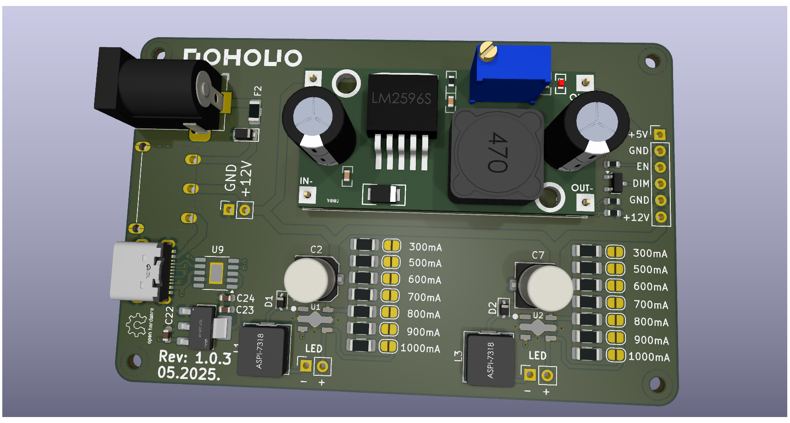
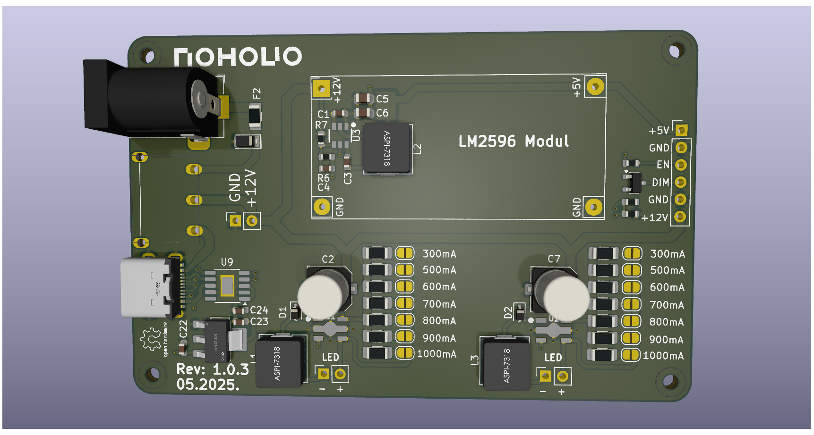
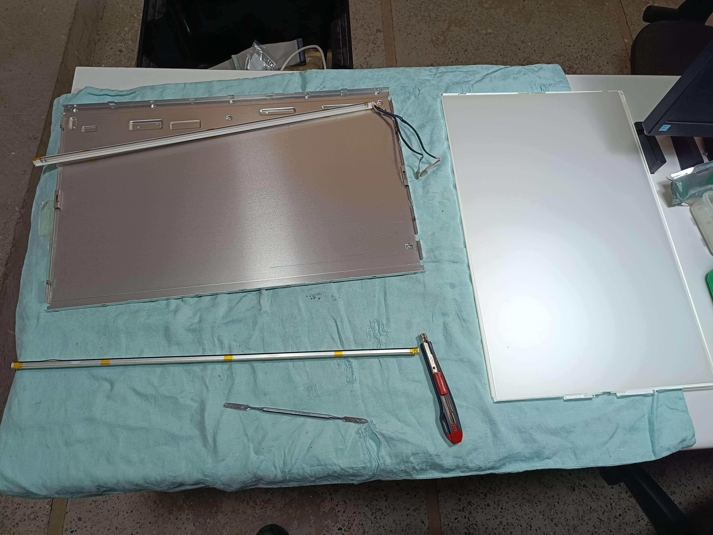
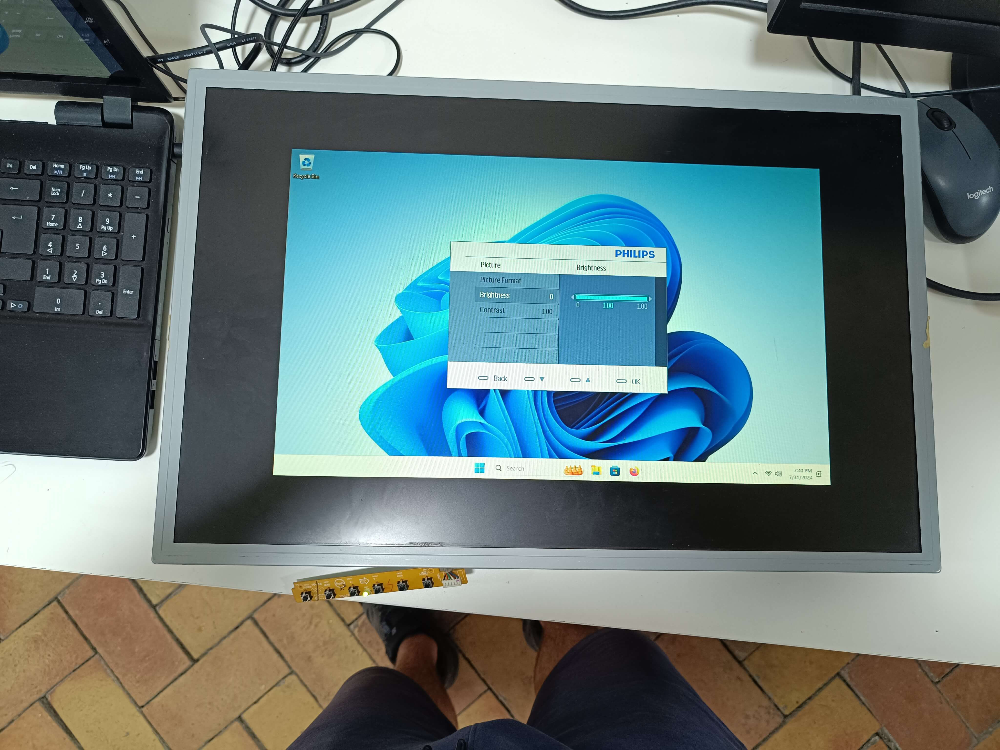

# CCFL2LED

Hi! I'm working on the R&D side of the Поново project. Through our initiative, where we upcycle old electronic devices in exchange for tree seedlings, we’ve noticed that LCD monitors are among the most common items ending up in landfills — and in our repair center as well.

Interestingly, the majority of these monitors share the same issue: the backlight. Most of them use CCFL (cold cathode fluorescent lamp) backlighting, which is often partially or completely non-functional.

As project volunteers, we concluded that replacing the CCFL lamps is not cost-effective. Instead, we aim to modernize these monitors by upgrading them to LED backlighting.

If there are any PCB design or engineering experts among you who would like to provide feedback on the design and concept — we would really appreciate it! We’d also be grateful if you could support our project by sharing it on social media or donating via [OpenCollective](https://opencollective.com/ponovo).

# Why is this change so important?

CCFL lamps are extremely harmful to the environment if broken, as they contain mercury, various metals, and plastics. They also have a significantly shorter lifespan and consume more power compared to LED technology (power consumption can be reduced by up to 40%). Controlling CCFLs requires complex electronics to drive an inverter that can generate up to 2kV AC. These circuits can degrade over time, leading to various failures, such as capacitor damage or degradation, which further impacts device operation.

Additionally, over time, CCFLs tend to yellow, giving the display a reddish or pinkish tint. That’s where LED strips come in — they are very easy to use, safer, more reliable, more available, cheaper, and longer-lasting.

# What are the results after the replacement?

The results were truly unexpected. We didn’t anticipate such a significant improvement in image quality — the colors became much more vibrant. There are no dark areas, and the light is evenly distributed across the screen. Efficiency increased, and power consumption was reduced by 30%.

# Plan and idea
The plan is to create an open-source, universal modular board for displays (composed of multiple parts/modules). This board currently combines several modules. For now, this is sufficient for us to recycle and upgrade monitors that arrive for recycling through the project [Поново](https://www.linkedin.com/company/ponovo/).

Here are picture of the working prototype (with the same chip tested on a 19", 22" and 24" display):

 

# About the Board

**Warning: This particular board has not yet been fully tested! It has only been tested using separate modules.**
 * **Power supply:** USB-C PD 12V or 12V 3A barrel jack (center-positive)
 * **LED driver:** PT4115 with parallel current sense resistors, calculated based on the [datasheet](https://www.lcsc.com/datasheet/lcsc_datasheet_1810121830_PowTech-CR-PowTech-Shanghai-PT4115B89E_C84512.pdf)
 * **Buck converter:** AP62201 ([datasheet](https://www.lcsc.com/datasheet/lcsc_datasheet_2308101545_Diodes-Incorporated-AP62201WU-7_C3194236.pdf))
 * **USB Type-C PD controller:** CH224K ([datasheet](https://www.laskakit.cz/user/related_files/ch224ds1.pdf))

  
  

# Choosing an LED strip

We recommend using a strip with 120 LEDs per meter. It’s also possible to implement the mod with a 60 LEDs/m strip, but the brightness will be noticeably lower. LED's must be 6500k color.
# Power Supply

A maximum of 36W is required (typically around 30W depending on screen size and number of LEDs). There are two input options, selectable via a switch. The USB-C Power Delivery input uses the CH224K chip configured for a 12V output, so it's crucial to ensure that your adapter supports 12V PD — otherwise, it will not work. The second input is a standard DC jack (5.5mm outer, 2.0mm inner, center-positive) with a 12V power supply.

# LED Driver

One PT4115 driver is used per side (especially important for larger screen sizes). Below is a table showing LED strip power consumption.  
Also included is a table with required resistor values. 
# Buck Converter

There are two options for the buck converter:
* Use a prebuilt LM2596 module and connect it to the board.
* Use the integrated circuit on the board — the AP62201WU-7 chip, which provides 5V for the logic board.
The maximum output power required is up to 8W at 5V.

# Modification
  **Warning: Before starting, make sure to clean the workspace and put on gloves!!!**
  
The steps we will go through in this process are:
* Carefully open the display and separate the backlight and the panel from the electronic boards.
* Continue opening the display and separate the panel from the housing, placing it in a clean area (be extremely careful during this step).
* Remove the diffusers, being careful not to mix up their order.
* Replace the CCFL (cold cathode fluorescent lamps), remove them, measure the appropriate length of LED strips, solder 30-40 cm of wire to them, and install them in place of the CCFL, then test them.
* Reinstall the diffusers and test the LED strips again to check if the diffusers have been properly returned to their place.
* Reinstall the panel (check that it is completely clean) and close that part of the display.
* Connect the LED backlight to the power supply board and link it to the display logic board.
* Test the monitor to check if all functions are working on the On-Screen Display (OSD) menu.
* Close the display and put it into operation.
- - - - 
1. **Carefully open the display and separate the backlight and the panel from the electronic boards.**

   -Be careful with the LVDS cable going to the panel
   

2. **Continue opening the display and separate the panel from the housing, placing it in a clean area (be extremely careful during this step).**

3. **Remove the diffusers, being careful not to mix up their order.**

4. **Replace the CCFL (cold cathode fluorescent lamps), remove them, measure the appropriate length of LED strips, solder 30-40 cm of wire to them, and install them in place of the CCFL, then test them.**

 
 -An example of bad backlighting

5. **Reinstall the diffusers and test the LED strips again to check if the diffusers have been properly returned to their place.**

  
  -Badly returned diffusers will have lines on the edges which is the case here
  

6. **Reinstall the panel (check that it is completely clean) and close that part of the display.**

7. **Connect the LED backlight to the power supply board and link it to the logic board of the display.**

-In this picture, the LED strips are not connected (I don't have a picture when they are connected)

8. **Test the monitor to check if all functions are working on the On-Screen Display (OSD) menu.**

9. **Close the display and put it into operation.**

# Next Steps
  * AC/DC Converter (230V AC to 12V DC)
  * Open-source universal logic board for monitors

